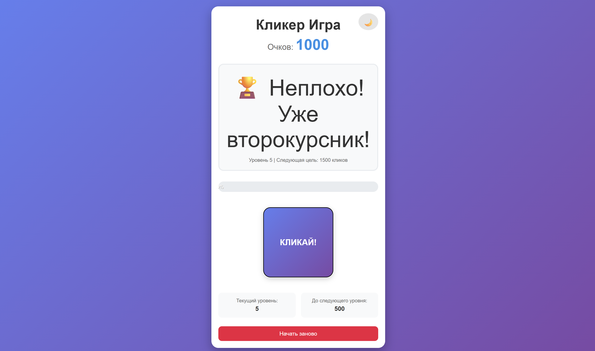

# 🎯 Кликер-игра

Кликер-игра - это интерактивное веб-приложение, разработанное на React, где пользователь зарабатывает очки путём кликов по кнопке. Особенностью игры является прогрессивная система уровней сложности и смена визуального оформления при достижении определённых целей.

---

## 📦 Запуск

### Быстрый запуск dev версии через cmd для разработки

```bash
npm run dev
```

---

### 🎯 Кликер-игра на GitHub Pages

[Публичная страница на GitHub Pages](https://ivansidelnikov259-alt.github.io/TIP/)

---

## 🎥 Демонстрация

### Примерный сценарий использования


---

## 🖼️ Скриншоты

### В данной программе доступна смена цветовой темы!

### Вид программы при светлой теме


---

### Вид программы при тёмной теме


---

## 🚀 Функции

- ✅ Система кликов с визуальной обратной связью
- 📈 Прогрессивные уровни сложности с увеличивающимися целями
- 🎯 Визуальная смена эмодзи при достижении целей
- 🌙 Переключение между светлой и тёмной темой
- 📊 Прогресс-бар для отслеживания прогресса до следующего уровня
- 🔄 Система сброса для начала игры заново
- 📱 Адаптивный дизайн для мобильных устройств

---

## 🎯 Уровни сложности
### Игра включает 24 уровня с постепенно возрастающими целями:

- Начальные уровни: 100, 250, 500 кликов
- Средние уровни: 500-1000 кликов
- Продвинутые уровни: 1000-10000 кликов
- Максимальный уровень: "👽 БОГ РТУ МИРЭА!" при 10000+ кликов

## 🛠 Технологии

- React
- HTML
- CSS
- JavaScript

---

## Выводы по выполненной работе

- Создано полнофункциональное React-приложение с нуля
- Реализован весь требуемый функционал согласно заданию
- Приложение имеет интуитивно понятный интерфейс
- Код хорошо структурирован и легко расширяем

---


